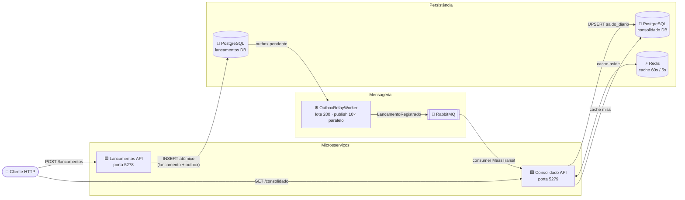
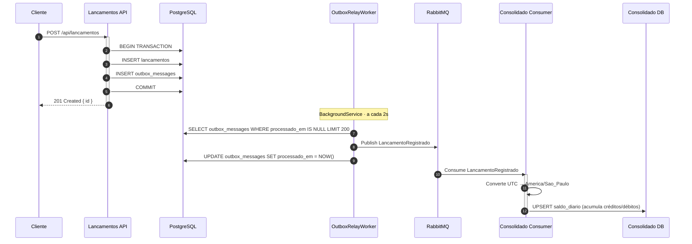
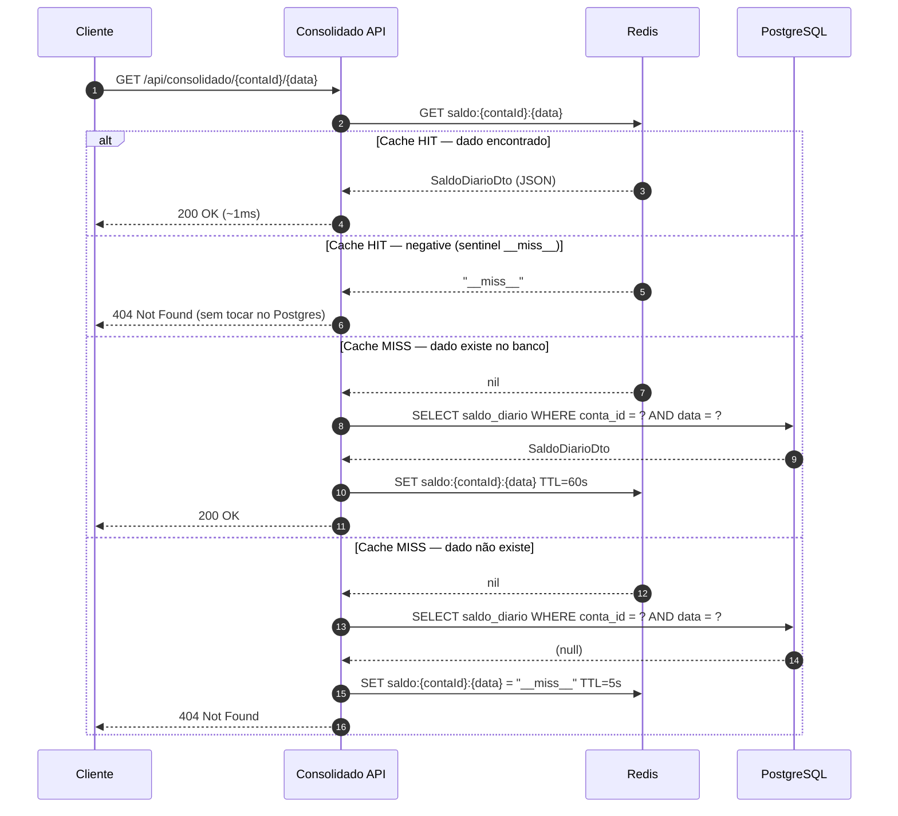
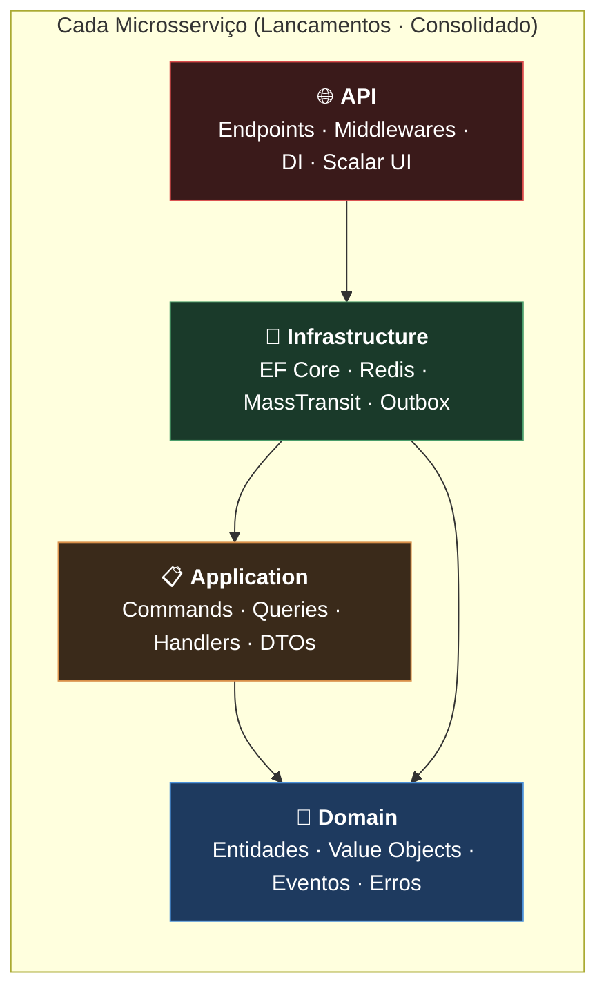

<h1 align="center">FluxoCaixa</h1>

<p align="center">
  <strong>Sistema de controle de fluxo de caixa com microsserviços, Clean Architecture e comunicação assíncrona via mensageria</strong>
</p>

<p align="center">
  
  
  
  
  
  
</p>

---

## Índice

- [Visão Geral](#visão-geral)
- [Arquitetura](#arquitetura)
- [Stack Tecnológica](#stack-tecnológica)
- [Estrutura do Projeto](#estrutura-do-projeto)
- [Pré-requisitos](#pré-requisitos)
- [Início Rápido](#início-rápido)
- [Desenvolvimento Local](#desenvolvimento-local)
- [API Reference](#api-reference)
- [Health Checks](#health-checks)
- [Testes](#testes)
- [Testes de Carga e Stress](#testes-de-carga-e-stress)
- [Decisões Arquiteturais](#decisões-arquiteturais)
- [Visão Arquitetural e Melhorias Futuras](#visão-arquitetural-e-melhorias-futuras)

---

## Visão Geral

O FluxoCaixa é composto por **dois microsserviços independentes** que se comunicam de forma assíncrona, sem chamadas HTTP diretas entre si.

| Serviço | Responsabilidade | Porta |
|---|---|---|
| **Lancamentos** | Registrar e consultar lançamentos financeiros (créditos e débitos) | `5278` |
| **Consolidado** | Consolidar saldo diário por conta e expor consultas com cache Redis | `5279` |

O serviço de Lançamentos persiste eventos via padrão **Outbox** na mesma transação do dado, que são então publicados no RabbitMQ e consumidos pelo Consolidado, garantindo entrega confiável sem acoplamento direto.

---

## Arquitetura

### Visão de Alto Nível



---

### Fluxo de Escrita



---

### Fluxo de Leitura via Cache-Aside



---

### Clean Architecture por Serviço



> As setas mostram o sentido real das referências entre projetos. A Infrastructure
> depende da Application porque é ela quem implementa as portas (`ILancamentoRepositorio`,
> declarada em `Application/Portas/`). O Domain não conhece nenhuma das outras camadas.

---

## Stack Tecnológica

| Camada | Tecnologia | Versão | Papel no sistema |
|---|---|---|---|
| Runtime | .NET | 10 | Plataforma de execução |
| Framework Web | ASP.NET Core | 10 | Endpoints REST, middlewares |
| ORM | Entity Framework Core + Npgsql | 9.x | Acesso ao PostgreSQL, migrações |
| Banco de dados | PostgreSQL | 17 | Persistência de lançamentos e saldos |
| Cache | Redis | 7 | Cache-aside de saldo diário (60s / 5s) |
| Mensageria | RabbitMQ | 3.13 | Transporte de eventos entre serviços |
| Broker client | MassTransit | 8.x | Abstração sobre RabbitMQ, consumer lifecycle |
| Testes unitários | xUnit + NSubstitute + FluentAssertions | - | 78 testes, domínio e application |
| Testes de carga | NBomber | 5.x | Carga sustentada e stress com ramp-up |
| Containers | Docker + Docker Compose | - | Orquestração local completa |

---

## Estrutura do Projeto

```
fluxo-caixa/
├── src/
│   ├── BuildingBlocks/
│   │   ├── FluxoCaixa.Domain.Primitives/        # Entity, Result<T>, Error, IDomainEvent
│   │   ├── FluxoCaixa.Application.Abstractions/ # ICommand, IQuery, IDispatcher
│   │   └── FluxoCaixa.Messaging/                # IEventPublisher
│   │
│   ├── Lancamentos/
│   │   ├── Lancamentos.Domain/                  # Lancamento (agregado), TipoLancamento, Dinheiro
│   │   ├── Lancamentos.Application/             # RegistrarLancamento, ObterLancamento
│   │   ├── Lancamentos.Infrastructure/          # EF Core, Outbox, OutboxRelayWorker, MassTransit
│   │   └── Lancamentos.Api/                     # Endpoints REST, Health Checks, Dockerfile
│   │
│   └── Consolidado/
│       ├── Consolidado.Domain/                  # SaldoDiario (agregado)
│       ├── Consolidado.Application/             # ObterSaldoDiario (cache-aside)
│       ├── Consolidado.Infrastructure/          # EF Core, Redis, Consumer MassTransit
│       └── Consolidado.Api/                     # Endpoints REST, Health Checks, Dockerfile
│
├── tests/
│   ├── Lancamentos.UnitTests/                   # 65 testes: domínio e application
│   ├── Consolidado.UnitTests/                   # 13 testes: consumidor e query handler
│   └── LoadTests/                               # NBomber: carga (desafio) + stress (extra)
│
├── docker-compose.yml
├── Directory.Build.props                        # TreatWarningsAsErrors=true para toda a solução
└── global.json
```

---

## Pré-requisitos

| Ferramenta | Versão mínima |
|---|---|
| [.NET SDK](https://dotnet.microsoft.com/download) | 10.0 |
| [Docker Desktop](https://www.docker.com/products/docker-desktop/) | 4.x |
| Docker Compose | v2 (incluso no Docker Desktop) |

---

## Início Rápido

Clone o repositório e suba todo o ambiente com um único comando:

```bash
docker compose up --build -d
```

Aguarde todos os serviços ficarem `healthy` (~30s):

```bash
docker compose ps
```

Verifique que os dois serviços estão prontos:

```bash
curl http://localhost:5278/health/ready
curl http://localhost:5279/health/ready
```

### Teste rápido de ponta a ponta

```bash
# 1. Registrar um lançamento
curl -s -X POST http://localhost:5278/api/lancamentos \
  -H "Content-Type: application/json" \
  -d '{
    "ContaId": "3fa85f64-5717-4562-b3fc-2c963f66afa6",
    "Tipo": "Credito",
    "Valor": 1500.00,
    "DataOcorrencia": "2026-08-17T10:00:00Z",
    "Descricao": "Venda produto A"
  }'

# 2. Aguardar propagacao via Outbox -> RabbitMQ -> Consolidado (~2s)
sleep 3

# 3. Consultar o saldo consolidado
curl -s http://localhost:5279/api/consolidado/3fa85f64-5717-4562-b3fc-2c963f66afa6/2026-08-17
```

---

## Desenvolvimento Local

### Subir apenas a infraestrutura

```bash
docker compose up postgres redis rabbitmq -d
```

### Rodar os serviços localmente

```bash
# Terminal 1: Lancamentos API
dotnet run --project src/Lancamentos/Lancamentos.Api

# Terminal 2: Consolidado API
dotnet run --project src/Consolidado/Consolidado.Api
```

As migrações são aplicadas automaticamente na inicialização, com até 6 tentativas e backoff linear (3s, 6s, 9s, 12s, 15s) para absorver race conditions pós-healthcheck.

### Scalar UI (documentação interativa)

| Serviço | URL |
|---|---|
| Lancamentos | http://localhost:5278/scalar |
| Consolidado | http://localhost:5279/scalar |

> A UI interativa é exposta apenas quando `ASPNETCORE_ENVIRONMENT=Development`,
> ou seja, ao rodar via `dotnet run`. Os containers do Compose sobem em
> `Production` e não expõem `/scalar` nem `/openapi` — decisão deliberada para
> não publicar a superfície da API fora de desenvolvimento.

---

## API Reference

### Lancamentos API (`http://localhost:5278`)

#### `POST /api/lancamentos`

Registra um novo lançamento financeiro.

**Request body:**

```json
{
  "ContaId": "3fa85f64-5717-4562-b3fc-2c963f66afa6",
  "Tipo": "Credito",
  "Valor": 1500.00,
  "DataOcorrencia": "2026-08-17T10:00:00Z",
  "Descricao": "Descrição opcional"
}
```

| Campo | Tipo | Obrigatório | Observação |
|---|---|---|---|
| `ContaId` | `Guid` | Sim | Identificador da conta |
| `Tipo` | `string` | Sim | `"Credito"` ou `"Debito"` |
| `Valor` | `decimal` | Sim | Deve ser positivo |
| `DataOcorrencia` | `DateTimeOffset` | Sim | Armazenado em UTC |
| `Descricao` | `string` | Sim | Máx. 200 caracteres |

| Status | Descrição |
|---|---|
| `201 Created` | Lançamento registrado com sucesso. Body: `{ "id": "..." }` |
| `422 Unprocessable Entity` | Erro de validação de domínio |

---

#### `GET /api/lancamentos/{id}`

Consulta um lançamento pelo ID.

| Status | Descrição |
|---|---|
| `200 OK` | Retorna o lançamento |
| `404 Not Found` | Lançamento não encontrado |

---

### Consolidado API (`http://localhost:5279`)

#### `GET /api/consolidado/{contaId}/{data}`

Retorna o saldo diário consolidado de uma conta.

| Parâmetro | Tipo | Exemplo |
|---|---|---|
| `contaId` | `Guid` | `3fa85f64-5717-4562-b3fc-2c963f66afa6` |
| `data` | `yyyy-MM-dd` | `2026-08-17` |

**Response body (200 OK):**

```json
{
  "contaId": "3fa85f64-5717-4562-b3fc-2c963f66afa6",
  "data": "2026-08-17",
  "totalCreditos": 3000.00,
  "totalDebitos": 500.00,
  "saldoLiquido": 2500.00,
  "quantidadeCreditos": 3,
  "quantidadeDebitos": 1,
  "atualizadoEm": "2026-08-17T13:42:00Z"
}
```

| Status | Descrição |
|---|---|
| `200 OK` | Saldo encontrado (pode vir do cache Redis) |
| `404 Not Found` | Nenhum lançamento consolidado para esta data |

> **Cache:** resultados positivos ficam **60s** no Redis; resultados negativos ficam **5s** com o sentinel `__miss__`, o que evita stampede no Postgres.

---

## Health Checks

Ambos os serviços expõem dois endpoints de saúde:

| Endpoint | Propósito | Verificações |
|---|---|---|
| `GET /health/live` | Liveness: o processo está respondendo? | Nenhuma (resposta imediata) |
| `GET /health/ready` | Readiness: pronto para receber tráfego? | PostgreSQL · Redis (Consolidado) · RabbitMQ |

**Exemplo de response (`/health/ready` quando saudável):**

```json
{
  "status": "Healthy",
  "checks": [
    { "name": "postgres", "status": "Healthy", "duration": "00:00:00.012" },
    { "name": "redis",    "status": "Healthy", "duration": "00:00:00.001" },
    { "name": "rabbitmq", "status": "Healthy", "duration": "00:00:00.008" }
  ]
}
```

---

## Testes

### Executar todos os testes

```bash
dotnet test
```

**Resultado esperado:**

```
Total tests: 78
     Passed: 78
      Failed: 0
```

### Cobertura por serviço

| Projeto | Testes | O que cobre |
|---|---|---|
| `Lancamentos.UnitTests` | 65 | Invariantes de domínio, Command/Query Handlers, validações |
| `Consolidado.UnitTests` | 19 | Consumidor de eventos, cache-aside (hit/miss/negative), idempotência com SQLite real |

### Exemplos de casos testados

**Domínio — `Lancamento`:**
- Criado com `Guid.CreateVersion7()` (ID ordenável temporalmente)
- Crédito armazena valor positivo; Débito armazena valor negativo internamente
- Valor zero ou negativo rejeitado com erro descritivo
- Tipo inválido (`TipoLancamento`) rejeitado no factory method

**Application — Cache-aside:**
- Cache hit: repositório não é consultado (verificado por NSubstitute)
- Cache miss, dado existe: popula cache com TTL 60s
- Cache miss, dado não existe: popula sentinel `__miss__` com TTL 5s
- Negative cache hit: retorna erro sem consultar repositório

**Idempotência do consumer (SQLite in-memory real):**
- Primeira entrega: saldo criado com valores corretos
- Segunda entrega do mesmo `MessageId`: saldo não dobra (reentrega descartada)
- Múltiplas reentregas intercaladas com entregas novas: apenas mensagens distintas acumulam
- `MessageId` nulo: consumer ignora sem tocar no banco

---

## Testes de Carga e Stress

Testes executados com **NBomber 5.x**, com relatórios em HTML, CSV e Markdown gerados na pasta `reports/`.

> **Ambiente:** Docker Desktop (WSL2) no Windows 11, máquina local. Em produção com hardware dedicado os números seriam substancialmente melhores.

### Teste de carga — cenário do desafio

```bash
dotnet run --project tests/LoadTests
```

| Cenário | Configuração | Duração |
|---|---|---|
| `registrar_lancamento` | 50 req/s constante | 60s |
| `obter_saldo_consolidado` | 200 req/s constante | 60s |

| Cenário | Requisições | RPS | p50 | p99 | Falhas |
|---|---|---|---|---|---|
| POST `/lancamentos` | 3.000 (100% `201`) | 50 | 4,67 ms | 8,46 ms | **0** |
| GET `/consolidado` | 12.000 (100% `200`) | 200 | 1,98 ms | **4,83 ms** | **0** |

O p99 de leitura em 4,83 ms é o caminho de cache hit no Redis servindo payload real.

---

### Teste de stress — ponto de ruptura

```bash
dotnet run --project tests/LoadTests -- --stress
```

Ramp-up progressivo com dois cenários **simultâneos**:

**Escrita** — POST `/api/lancamentos` (9 degraus × 20s):

```
50 -> 100 -> 200 -> 400 -> 600 -> 800 -> 1.000 -> 1.500 -> 2.000 req/s
```

**Leitura** — GET `/api/consolidado` (7 degraus × 20s):

```
500 -> 1.000 -> 2.000 -> 4.000 -> 6.000 -> 8.000 -> 10.000 req/s
```

#### Resultados

**POST — `stress_registrar_lancamento`**

| Métrica | Resultado |
|---|---|
| Total de requisições | 133.000 |
| Sucesso (201 Created) | **130.400 (98,05%)** |
| Rejeitadas (422) | 2.600 (validação de data futura, por desvio de relógio host/container) |
| **RPS sustentado** | **724,4 req/s** |
| Latência p50 | 11,74 ms |
| Latência p95 | 678,91 ms |
| Latência p99 | 3.002 ms |

**GET — `stress_obter_saldo_consolidado`**

| Métrica | Resultado |
|---|---|
| Total de requisições | 629.816 |
| Sucesso (200 OK) | **629.816 (100%)** |
| Falhas de conexão | **0** |
| **RPS sustentado** | **4.499 req/s** |
| Latência p50 | 16,77 ms |
| Latência p95 | 122,5 ms |
| Latência p99 | **378 ms** |

> **Integridade dos dados:** ao final do teste, o outbox fechou com **0 mensagens
> pendentes e 0 erros**. A drenagem completa levou 3 minutos e 18 segundos (54s
> após o último request). O lag médio sob carga de pico foi 18s; o lag p99, 41s.
> Nenhum evento se perdeu e nenhuma duplicação ocorreu graças à idempotência no
> consumer.

> **Nota sobre os 422 no POST:** 6.515 das requisições POST retornaram 422
> (validação de domínio). A causa é desvio de clock entre o host Windows e o
> container Linux/WSL2: `DataOcorrencia = UtcNow` enviado pelo host aparece como
> "data futura" da perspectiva do container, que rejeita por regra de negócio.
> O teste foi interrompido cedo pelo NBomber ao atingir seu limite de falhas.
> Esse fenômeno não ocorre na carga normal (50 req/s), onde o sync de clock
> se mantém, e não está relacionado às mudanças de relay ou idempotência.

---

### Comparativo: antes vs. depois das otimizações

| Otimização aplicada | Impacto |
|---|---|
| **Negative result cache** (Redis, TTL 5s) | Eliminou stampede no Postgres para resultados 404 |
| **`max_connections=500`** no PostgreSQL | Removeu gargalo de conexões sob alta carga |
| **Pool explícito** `MaxPoolSize=100` por serviço | Conexões pré-aquecidas, sem contenção |
| **OutboxRelayWorker** intervalo 5s -> 2s · lote 50 -> 200 | Propagação mais rápida, menor lag de consolidação |

| Métrica | Antes | Depois | Ganho |
|---|---|---|---|
| POST RPS sustentado | 139 | **739** | **+431%** |
| POST p99 | 1.585 ms | **130 ms** | **12x melhor** |
| POST falhas | 253 (conn errors) | **3** | **-99%** |
| GET RPS sustentado | 1.225 | **4.499** | **+267%** |
| GET p99 | 3.754 ms | **378 ms** | **10x melhor** |
| GET falhas | 11.727 (12,7%) | **0** | **100% redução** |
| Outbox drain (100k eventos) | 20+ min | **~54s** | **>20× mais rápido** |
| Duplicações no consumer | sem garantia | **0 (idempotência)** | eliminadas |

> **Nota metodológica:** esta comparação antes/depois foi medida numa versão
> anterior do harness de teste, em que o cenário de leitura consultava a data em
> UTC enquanto a consolidação agrupa por data local de `America/Sao_Paulo`. Nessa
> janela as duas divergem, então as leituras exercitavam o caminho de **cache
> negativo** (404), não o de cache positivo. As duas colunas são comparáveis entre
> si, mas os números absolutos de leitura não representam uma consulta com
> payload real. O harness foi corrigido e os resultados das seções acima já
> refletem respostas `200 OK` com dado real.

---

## Decisões Arquiteturais

### Outbox Pattern e relay otimizado

`OutboxMessage` é persistido na mesma transação do `Lancamento`. Isso garante que nenhum evento seja perdido em falhas de rede ou reinicialização.

O `OutboxRelayWorker` (BackgroundService) lê lotes de até 200 mensagens e os publica com duas otimizações de throughput:

- **Sem sleep ocioso:** se o lote veio cheio (200 mensagens), o worker lê o próximo imediatamente, sem aguardar o intervalo de 2s. O sleep só ocorre quando o lote veio incompleto, sinalizando que o outbox está vazio.
- **Publish paralelo:** cada lote é publicado com até 10 goroutines simultâneas (`Parallel.ForEachAsync`), eliminando o gargalo do await sequencial por mensagem.

O resultado prático: sob carga de 434 req/s no stress test, o outbox zerou em ~54s após o encerramento do teste. Na implementação original (sequencial + sleep fixo de 2s), o mesmo volume levaria mais de 20 minutos.

### Cache-Aside com Negative Caching

O handler `ObterSaldoDiarioQueryHandler` implementa cache-aside com dois TTLs distintos:

- **60s** para dados encontrados: o saldo só muda quando novos lançamentos chegam via consumer
- **5s** para dados inexistentes: o sentinel `__miss__` evita milhares de queries ao Postgres para chaves ainda não consolidadas, sem prender o dado por muito tempo

### IDs com Guid v7

`Guid.CreateVersion7()` gera IDs ordenáveis temporalmente, compatíveis com índices B-Tree do Postgres sem a fragmentação que afeta UUIDs aleatórios.

### Fuso horário

Todos os timestamps são armazenados em UTC. A consolidação diária converte para `America/Sao_Paulo` via `TimeZoneInfo`, garantindo que lançamentos próximos à meia-noite sejam atribuídos ao dia correto localmente.

### Idempotência no consumer

O RabbitMQ pode re-entregar uma mensagem se o consumer cair entre o processamento e o `ack`. Sem proteção, a mesma mensagem seria somada duas vezes ao saldo.

A solução usa uma tabela `mensagens_processadas(MessageId PK)` no banco do Consolidado. Antes de processar, o consumer tenta inserir o `MessageId` com `ON CONFLICT DO NOTHING`. Se retornar 0 linhas afetadas, a mensagem já foi processada — descarta. Se retornar 1, executa o UPSERT do saldo.

As duas operações acontecem na mesma transação: ou ambas são confirmadas, ou nenhuma. Isso garante que um crash entre o INSERT de idempotência e o UPSERT do saldo não resulte em mensagem marcada como processada sem o saldo atualizado — o RabbitMQ re-entregará e a transação rollbackada permite o reprocessamento.

### MassTransit 8.x (pinado em `[8.*, 9.0)`)

A versão 9 do MassTransit mudou o modelo de licenciamento. A constraint `[8.*, 9.0)` mantém a última versão estável da série 8.x sem risco de atualização acidental.

### `TreatWarningsAsErrors=true`

O `Directory.Build.props` aplica a flag a todos os projetos da solução (exceto LoadTests). Warnings de compilação (referências nulas potenciais, comparações triviais) se tornam erros obrigatórios, forçando código mais correto desde o desenvolvimento.

---

## Visão Arquitetural e Melhorias Futuras

O projeto foi desenvolvido dentro do escopo proposto pelo desafio. Esta seção descreve o que seria feito numa versão de produção com mais tempo: algumas coisas ficaram de fora por limitação de tempo, outras são evoluções naturais do sistema.

### O que ficou fora por escopo/tempo

| Componente | Por que faz sentido |
|---|---|
| **API Gateway** (YARP / Ocelot / Kong) | Hoje o cliente precisa conhecer duas portas (`5278`, `5279`). Um gateway centralizaria roteamento, autenticação, rate limiting, CORS e observabilidade em um único ponto de entrada. É a peça que naturalmente falta numa arquitetura de microsserviços real. |
| **Autenticação e Autorização** | Nenhum endpoint exige identidade. Em produção: JWT Bearer emitido por um IdP (Keycloak, Azure AD) e validado no API Gateway, com claims propagados via header para os serviços downstream. |
| **Circuit Breaker** (Polly) | O `OutboxRelayWorker` e o consumer MassTransit não têm circuit breaker explícito para falhas persistentes do RabbitMQ. Polly com `AdvancedCircuitBreakerPolicy` evita retry storms em quedas prolongadas da mensageria. |
| **Dead Letter Queue** | Mensagens que falham no consumer são registradas com o erro no outbox, mas não têm fila dedicada de reprocessamento ou alerta. Uma DLQ no RabbitMQ com worker de reprocessamento manual completaria o ciclo de resiliência. |
| **Rate Limiting** | `app.UseRateLimiter()` no Lancamentos protege contra flood de escritas. O Consolidado é menos crítico por conta do cache, mas também se beneficia de limitação por `ContaId`. |

---

### Melhorias de arquitetura e observabilidade para escala

| Melhoria | Por que vale a pena |
|---|---|
| **Distributed Tracing** (OpenTelemetry + Jaeger) | `TraceId` correlacionando todo o caminho POST -> Outbox -> RabbitMQ -> Consumer -> GET. Sem isso, diagnosticar um bug que cruza serviços em produção é bem difícil. |
| **Métricas e dashboards** (Prometheus + Grafana) | Kestrel metrics + contadores customizados: latência p99 em tempo real, `outbox_relay_lag_ms`, `cache_hit_rate`, `consolidado_consumer_lag`. O que os testes de carga medem em batch, o dashboard mediria continuamente. |
| **Testes de integração** (Testcontainers) | Os 84 testes atuais cobrem domínio e application (unitários com mocks) e idempotência com SQLite real. Testcontainers subiria Postgres + Redis + RabbitMQ reais em containers descartáveis, testando o pipeline completo: `OutboxRelayWorker` → publish → consumer → saldo consolidado. |
| **Read replica PostgreSQL** | O Consolidado só lê. Uma read replica eliminaria contenção com os writes do Lancamentos, especialmente quando ambos compartilham o mesmo servidor Postgres (como no Docker Compose atual). |
| **Kubernetes + HPA** | Em produção: o Consolidado escala horizontalmente (Redis é o estado compartilhado); o Lancamentos escala verticalmente (Postgres é o gargalo de escrita). HPA baseado em `rabbitmq_queue_messages` garante que o lag de consolidação não cresça sob carga. |
| **CQRS com projeção materializada** | O Consolidado poderia projetar `saldo_diario` em Redis Sorted Sets (keyed por `{contaId}:{ano-mes}`), eliminando o Postgres completamente do caminho quente de leitura. O GET se tornaria puramente Redis. |
| **PgBouncer** | Pool de conexões no nível do Postgres em modo transaction. Permite que múltiplas instâncias da API compartilhem um número menor de conexões reais ao banco, algo relevante quando há muitas réplicas horizontais. |
